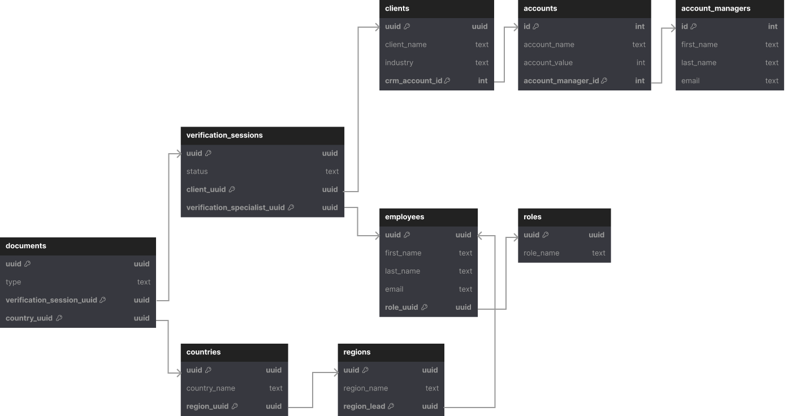

# dbt Data Model - Verification Summary Analysis

## Description
Stakeholders need data to make informed decisions, but that data doesn't exist in a clean, accessible format. 

The task is to solve the problem of messy data. Taking raw data and preparing it for consumption by data analysts, data scientists, and decision makers through considerate, optimized data modeling.

 

## Task
To design and implement a data model using dbt to optimize for analytics of verification sessions.

Below are the questions this model should be able to answer:
1. Which regions have the most declined sessions?
2. Which document types get resubmitted the most?
3. Which is the most popular industry in each region?

 

## Tech Stack

 

## Database Schema

This schema represents raw data in the data warehouse. It contains data from our production database in the prod schema and data from our CRM in the CRM schema. 

We don't want to expose this data to our reporting tools because it is highly normalized and has not had any business logic applied to it.

 

### Tables

*verification_sessions*
> Each verification has a status of 
> + Approved 
> + Declined 
> + Resubmission

*documents*
>Three types of document are supported: 
> - Passport
> - Residence Permit
> - Drivers License

*countries*
> Countries that issue documents are grouped into regions that share some similar characteristics such as language. 
> 
> Regions are a slowly changing dimension. The region a country belongs to can change over time. 

*regions*
> This table contains a list of the regions that countries are group into. 

*employees*
> This table contains all the employees in the company, along with their roles.

*roles*
>This table contains a list of roles in the company. There are three roles: 
> - Verification Specialist
> - Region Lead
> - Account Manager

*clients*
> This table keeps track of all clients. It also contains information about the industry those clients operate in.

*accounts*
> It contains information about the clients and their account values. 
>
> Each client has an account manager who is an employee in the company.

*account_managers*
> This table contains information about account managers in our CRM. The employees are from the same company.

